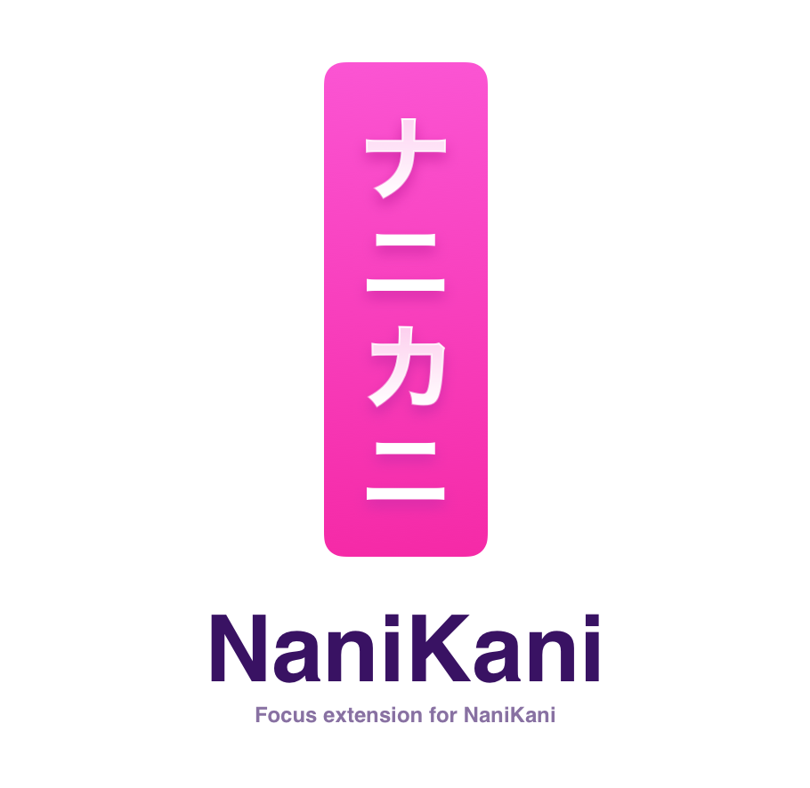

  

# NaniKani

A Chrome extension that hides statistics lessons, reviews and extra study on WaniKani to help you focus on learning.

## Why?

Every now and then while using WaniKani, I get too focused on the numbers, the right answers, the percentage, the items left... I experimented using WaniKani removing the. progress while doing the lessons, the practice or the extra study and I focused more on the learning process.

NaniKani does that. Hides the progress and let's you focus on the study.

## What?

- Hides quiz statistics during lessons and reviews
- Works on `/subject-lessons` and `/recent-mistakes` and `/subject` pages
- Automatically applies when navigating within WaniKani

## Features

### Hide Stats
Choose where to hide quiz statistics:
- **Lessons** - Hide stats on `/subject-lessons` pages
- **Reviews** - Hide stats on `/subjects/review` pages
- **Extra Study** - Hide stats on `/recent-mistakes` pages

### Hide Progress Bar
Optionally hide the quiz progress bar (`.quiz-progress`) across all study sessions to fully immerse yourself in the learning experience.

All settings are accessible via the extension popup and are saved automatically.

## How?

I'm still experimenting with this extension but if you want to give it a try:

1. Clone or download this repository
2. Open Chrome and go to `chrome://extensions/`
3. Enable **Developer mode** (top right)
4. Click **Load unpacked**
5. Select the `nanikani` folder

Once installed, click the NaniKani extension icon to customize which elements to hide:

- `.character-header__menu-statistics`
- `.quiz-statistics`
- `.quiz-statistics__item`
- `.quiz-progress` (optional)

## Disclaimer

This extension is provided "as is" without warranty of any kind. The author is not responsible for any consequences resulting from the use of this extension.

**NaniKani is an independent project and is not affiliated with, endorsed by, or in any way officially connected to WaniKani or Tofugu LLC.**

Contributions and feedback are welcome! Feel free to open an issue or submit a pull request.
