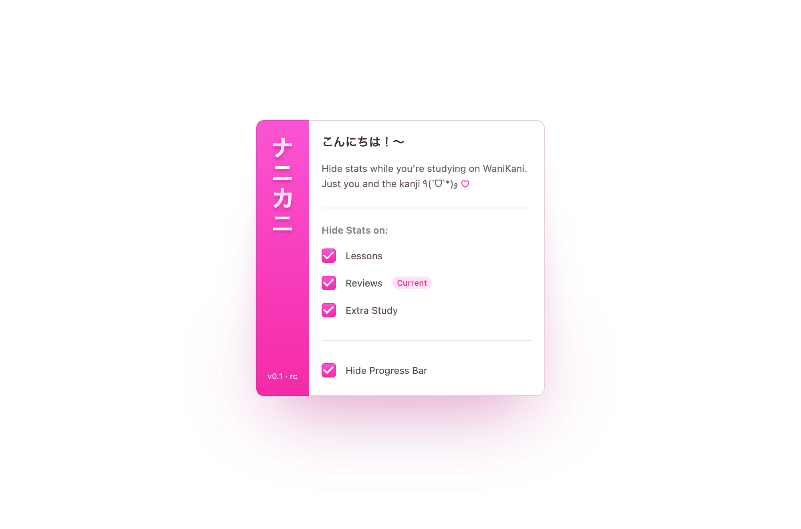

  

# NaniKani

Hide quiz statistics on WaniKani and focus purely on learning — just you and the kanji 🌸

## About

We've all been there. You're supposed to be learning kanji, but instead you're staring at that percentage going "okay, 73%... if I get the next 5 right, I'll be at 78%..."

NaniKani hides all those distracting numbers so you can actually focus on what matters 〜

  

## Features

**🎯 Hide Stats Where You Want**
- **Lessons** — No stats, just learning
- **Reviews** — Focus mode activated
- **Extra Study** — Peaceful practice

**📊 Hide Progress Bar**
Because sometimes you don't need to know you're only 12% done. Ignorance is bliss.

**✨ Smart "Current" Indicator**
The popup tells you which page you're on. Helpful little thing.

**⚡ Zero Config**
Install it. Click things. It just works. Settings save automatically.

## Installation

### Chrome Web Store
Install directly from the [Chrome Web Store](#) (link coming soon).

### Manual Installation
1. Clone or download this repository
2. Open Chrome and go to `chrome://extensions/`
3. Enable **Developer mode** (top right)
4. Click **Load unpacked**
5. Select the `nanikani` folder

## Privacy

NaniKani doesn't collect anything. Your data stays on your device. We're here to hide stats, not harvest data. See the [Privacy Policy](PRIVACY.md) if you want the formal version.

## Disclaimer

This extension is provided "as is" — use at your own risk, etc. etc.

**NaniKani is a fan project and has no affiliation with WaniKani or Tofugu LLC.**

---

Found a bug? Have an idea? Open an issue or PR — contributions welcome! 💛
